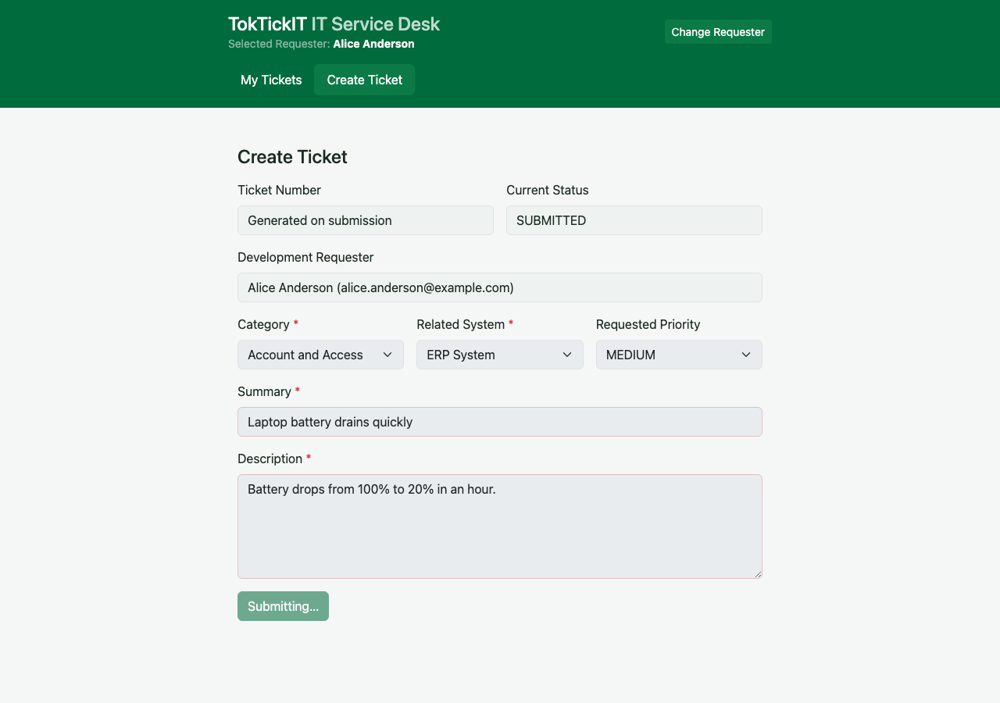
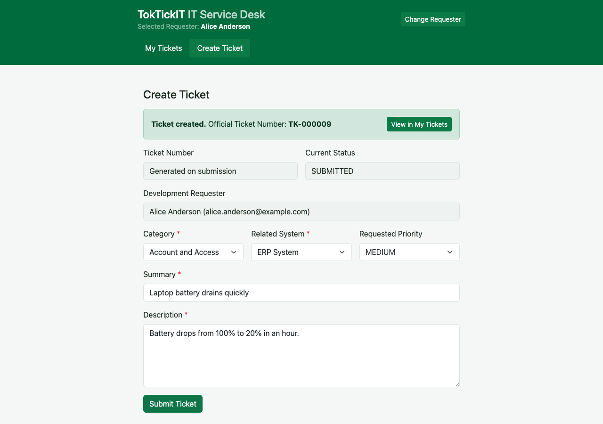
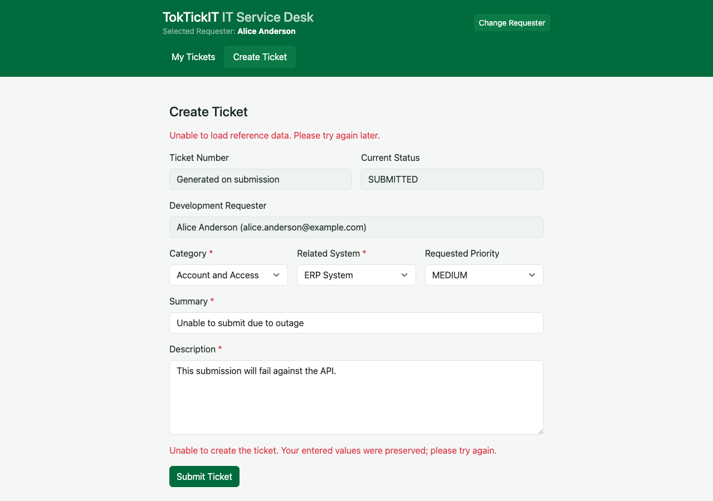
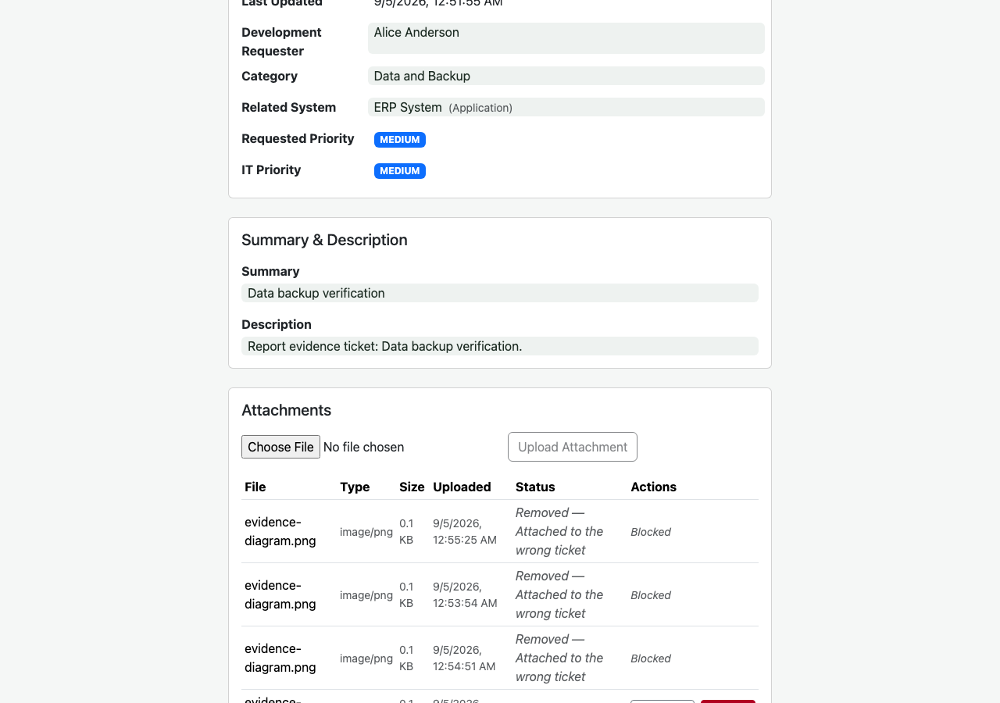

# Lab 2 — LEB2 Project Implementation and Report

**Project:** TokTickIT — IT service desk (CPE 334, Labs 1–4)
**Lab 2 scope:** Development Requester session → Create Ticket → My Tickets → Ticket Detail + Attachments → Zen Green responsive UI
**Author:** นางสาวอชิรญา อินตา — 67070505229 — GitHub: [@Achikan](https://github.com/Achikan)
**Peer reviewer:** นายธนากร พหุลรัตน์ — 67070505217 — GitHub: [@il0lk3](https://github.com/il0lk3)
**Repository:** https://github.com/Achikan/TokTickIT

All documentation lives in `docs/lab-02/` of the submitted repository (`main` branch after
the release merge; this report was built from `lab2-staging`). Screenshots are readable at
normal zoom and are embedded below with their source paths.

---

## Answer Part 1: Git Use with Engineering Workflow

**Evidence: commit history in the final `main` branch showing feature branches merged into staging then main.**

The workflow used for every Lab 2 Issue: `feature/<n>-<slug>` branch → peer review on a Pull
Request → reviewer approves → merge into `lab2-staging` → final release PR `lab2-staging` → `main`.

Commits are small, conventional, and tied to Issues (`feat:`, `docs:`, `refactor:`, `fix:`).

| Item | Evidence |
|---|---|
| Commit history (feature → staging → main graph) | `artifacts/lab-02/screenshots/part-1-git-evidence/01-commit-history.png` |
| PR review record (all Lab 2 PRs reviewed and approved) | `artifacts/lab-02/screenshots/part-1-git-evidence/05-pr-review-table.png` |
| GitHub Issues (all closed = Kanban Done) | `artifacts/lab-02/screenshots/part-1-git-evidence/06-issues-done.png` |
| Rendered reviewer.md | [docs/lab-02/reviewer.md](reviewer.md) |
| README | [README.md](../../README.md) |
| .gitignore | [.gitignore](../../.gitignore) |
| Directory structure in the IDE | `artifacts/lab-02/screenshots/part-1-git-evidence/02-directory-structure.png` |
| README content | `artifacts/lab-02/screenshots/part-1-git-evidence/03-readme.png` |
| .gitignore content | `artifacts/lab-02/screenshots/part-1-git-evidence/04-gitignore.png` |

**PR list (all written by me, reviewed by @il0lk3, merged into `lab2-staging`):**

| PR | Branch → base | Title | Verdict |
|---|---|---|---|
| #25 | `feature/5-spec-test-plan` → `lab2-staging` | docs: Lab 2 engineering contract (Issue 5) | CHANGES_REQUESTED → APPROVED |
| #26 | `feature/6-db-models-seed` → `lab2-staging` | feat: Lab 2 data model, migration, seed (Issue 6) | APPROVED |
| #27 | `feature/7-requester-selection` → `lab2-staging` | feat: Development Requester selection (Issue 7) | APPROVED |
| #28 | `feature/8-ticket-creation` → `lab2-staging` | feat: Ticket creation API + Create Ticket (Issue 8) | CHANGES_REQUESTED → APPROVED |
| #29 | `feature/9-my-tickets` → `lab2-staging` | feat: My Tickets list (Issue 9) | CHANGES_REQUESTED → APPROVED |
| #30 | `feature/10-ticket-detail` → `lab2-staging` | feat: Ticket Detail screen (Issue 10) | CHANGES_REQUESTED → APPROVED |
| #31 | `feature/11-attachments` → `lab2-staging` | feat: Attachment lifecycle (Issue 11) | CHANGES_REQUESTED → APPROVED |
| #32 | `feature/12-zen-green-ui` → `lab2-staging` | feat: Zen Green UI & Responsive (Issue 12) | CHANGES_REQUESTED → APPROVED |
| #33 | `feature/13-automated-tests` → `lab2-staging` | feat: Automated Tests E2E (Issue 13) | CHANGES_REQUESTED → APPROVED |
| #34 | `feature/14-visual-inspection` → `lab2-staging` | docs: Visual Inspection & Evidence (Issue 14) | APPROVED |
| #35 | `feature/15-docs-review-release` → `lab2-staging` | docs: finalize Lab 2 docs (Issue 15) | APPROVED |
| #36 | `lab2-staging` → `main` | Release Lab 2 | Peer-approved → merged into `main` |

**Kanban:** GitHub Project board used with all Issues moved to **Done** as work completed.
The final board screenshot (all cards in Done) is captured manually from the GitHub web UI —
see `kanban-done.png` below. All Issues #23–#34 status is *Closed* as shown in
`part-1-git-evidence/06-issues-done.png`.

---

## Answer Part 2: Spec DD

**Linked rendered copy:** [docs/lab-02/specification.md](specification.md)

The specification is written as an engineering contract **before** any implementation. It
contains:

- **Numbered functional requirements** (FR-01 … FR-17) with acceptance criteria (AC-01 … AC-15);
- **Business rules** (BR-01 … BR-10) covering ticket number format, requester ownership, status
  workflow, attachment rules (types/size/count), and pagination defaults;
- **Definition of Done** section listing measurable completion gates (tests pass, docs sync,
  screenshots captured, reviewer approval);
- Stakeholder request → scope-in/scope-out mapping at the top of the document.

The signature commit `5a42d1f docs: add Lab 2 engineering contract (spec, tests, ui-spec,
api-spec)` lives in `feature/5-spec-test-plan`, which was merged via **PR #25 on 2026-09-01** —
*before* the first implementation PR (#28, Ticket creation, merged 2026-09-02). The screenshot
below proves the spec existed before the main implementation PRs:

---

## Answer Part 3: Test DD and Traceability

**Linked rendered copy:** [docs/lab-02/tests.md](tests.md)

The plan was written up front (Test DD) from `specification.md`. It contains:

- the **planned-test table** (unit / API / UI / style / responsive / E2E) mapped one-to-one to each
  Requirement + Acceptance Criterion;
- **acceptance-criterion traceability** (each AC has at least one test; test names embed the AC tag,
  e.g. `API-04, AC-05, FR-11`);
- **actual test-file paths** (`server/tests/lab-02/`, `client/tests/lab-02/`, `e2e/lab-02/`);
- **final pass status**:

| Suite | Count | Result |
|---|---|---|
| Server (unit + API) — `npm test` in `server/` | 52 | ✅ 52/52 |
| Client (UI + style) — `npm test` in `client/` | 51 | ✅ 51/51 |
| E2E + responsive — `npm run test:e2e` (root) | 11 | ✅ 11/11 |

Complete passing output (server and client), captured from the current implementation:

(The rubric asks for output *from main*; the same code and counts are on `main` after the
release PR #36 merge — output above was generated from the Lab 2 release branch.)

---

## Answer Part 4: AI Use with Reflection

**Linked rendered copy:** [docs/lab-02/ai-use.md](ai-use.md)

- **LLM/agent used:** opencode (The Agent SDK) — an AI coding agent that edits and verifies code
  in this repository, used for Spec-Driven Development (Appendix A workflow) and TDD.
- ai-use.md contains a table of **selected real prompts** (9 key prompts) covering elicitation,
  spec refinement, API design, test-first implementation, responsive/accessibility fixes,
  E2E coverage, and documentation finalization — each followed by a short "what I then did"
  note that explains how the prompt was applied and verified.
- The document intentionally records prompts that exposed gaps (e.g., requester ownership,
  non-disclosing 404, soft-delete attachments, strict-mode E2E assertions) and my resulting
  actions, rather than only polished steps.

**My Reflection:** The agent drafts are good accelerators but not a substitute for reading the
labsheet and rubric myself. Several agent suggestions silently drifted from what the teacher
asked for (e.g., screenshot coverage of the requested Create-Ticket states). I learned to treat
the rubric as the source of truth, review every generated item against it myself, and use the
agent to close the gaps I found — not the reverse. Writing my own prompt summary
("I will earn the information by asking the right questions, not by reading the answers")
became my guiding principle.

---

## Answer Part 5: Development Requester Select Screen

The simulated **login** screen lets the session choose *who* the Development Requester is. It is
scored inside Part 6 (Working Ticket Screen: Create Mode).

States captured — initial loading, loaded active-user dropdown, and selected-user display:

The requested user is shown in the header ("Selected Requester") with a **Change Requester**
action that returns to the selection screen (failure state shows "Unable to load development
requesters.").

---

## Answer Part 6: Working Ticket Screen — Create Mode

Evidence covers the Teacher's §4 User Stories and the required states.

### 1. Requester field populated from the Development Requester; saved ticket matches

The requester is chosen *before* entering the app; the saved Ticket stores the matching
`requesterId`, and the official ticket number + saved values come back from the database:

### 2. Reference data loaded from the database

### 3–6. Required states (initial, validation failure, submitting, success, API failure, invalid attachment)

**Invalid attachment:** the Create Ticket form has no file input (attachments belong to Ticket
Detail, per the API), so an invalid upload (unsupported type — a `.txt` file) is rejected with a
field-level/alert error at the attachment control:

---

## Answer Part 7: Working My Tickets Screen

Requester **Alice** selected → her ticket list. Switch to Requester **Bob** → Alice's tickets
disappear (requester-scoped list). Then search, filters, sort, pagination, empty state,
no-results, and cross-requester access evidence.

| State | Screenshot |
|---|---|
| Requester A (Alice) ticket list | `part-7-my-tickets/01-alice-list.png` |
| Requester B (Bob) ticket list (A's disappear) | `part-7-my-tickets/02-bob-list.png` |
| Search | `part-7-my-tickets/03-search.png` |
| Filter by category | `part-7-my-tickets/04-filter-category.png` |
| Filter by priority | `part-7-my-tickets/05-filter-priority.png` |
| Filter by status — no matches | `part-7-my-tickets/06-filter-status-no-matches.png` |
| Sort | `part-7-my-tickets/07-sort.png` |
| Pagination | `part-7-my-tickets/08-pagination.png` |
| Empty state (Requester C — no tickets) | `part-7-my-tickets/09-empty-state.png` |
| No-results state | `part-7-my-tickets/10-no-results.png` |
| Cross-requester: Alice's list excludes Bob's tickets | `part-78-evidence/01-my-tickets-owner-only.png` |
| Cross-requester: direct access to another requester's ticket rejected | `part-78-evidence/02-unauthorized-access-rejected.png` |

---

## Answer Part 8: Working Ticket Screen — View Mode and Attachments

Owned Ticket Detail, add attachment, download active attachment, soft removal with reason,
retained metadata, blocked removed download, and unauthorized ticket-access evidence.

| State | Screenshot |
|---|---|
| Owned Ticket Detail (read-only fields, status/priority badges) | `part-8-ticket-detail/01-owned-detail.png` |
| Add attachment (valid) | `part-8-ticket-detail/02-add-attachment.png` |
| Download active attachment | `part-8-ticket-detail/03-download-active.png` |
| Soft removal with reason (Screenshot REMOVED, reason retained) | `part-8-ticket-detail/04-soft-removed.png` |
| Blocked removed download (410 on API) | `part-8-ticket-detail/05-blocked-download.png` |
| Unauthorized ticket access rejected (non-disclosing 404) | `part-78-evidence/02-unauthorized-access-rejected.png` |
| Attachment states (initial / valid / invalid / removed) | `ticket-detail-attachments/01..04` |

Attachment lifecycle states:

**Cross-requester rejection:** the API verifies the requester owns the ticket/attachment. A
request with Alice's `X-Requester-Id` for Bob's ticket returns a generic 404 (does not leak
existence), and the UI has no access to the foreign ticket number. Evidence:
`part-78-evidence/02-unauthorized-access-rejected.png`.

---

## Answer Part 9: Zen Green UI and Responsive Evidence

**Linked rendered UI spec:** [docs/lab-02/ui-spec.md](ui-spec.md)

Desktop / tablet / mobile screenshots of the three main screens:

| Screen | Desktop (1280) | Tablet (820) | Mobile (390) |
|---|---|---|---|
| Create Ticket | `create-ticket/desktop.png` | `create-ticket/tablet.png` | `create-ticket/mobile.png` |
| My Tickets | `my-tickets/desktop.png` | `my-tickets/tablet.png` | `my-tickets/mobile.png` |
| Ticket Detail | `ticket-detail/desktop.png` | `ticket-detail/tablet.png` | `ticket-detail/mobile.png` |

**Completed visual checklist** (colors, editable vs read-only fields, validation placement,
button hierarchy, clipping/overlap/horizontal overflow) is in
[visual-inspection.md §2](visual-inspection.md) — all items pass, enforced by automated
RESP-01 responsive assertions (no horizontal scroll at any viewport) and STYLE-01 token tests.
The only documented deviation is the initial `SUBMITTED` status (see visual-inspection.md §6).